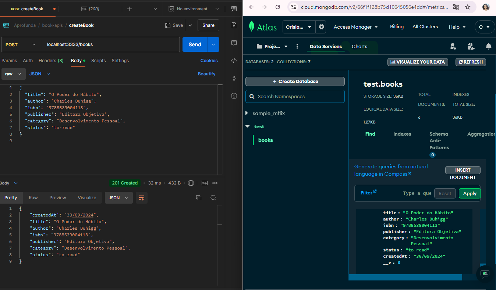

# Biblioteca da Cris 📚📖

O objetivo desse projeto é desenvolver uma aplicação de gerenciamento de uma biblioteca. O projeto permite o cadastro, atualização, listagem e remoção de livros, facilitando o controle e organização de uma coleção literária. Este projeto segue os princípios da Clean Architecture, que separa as responsabilidades da aplicação em camadas. Isso garante que a lógica de negócios seja independente de frameworks e bibliotecas externas, facilitando a manutenção, escalabilidade e teste do sistema. 


## Funcionalidades

- Cadastro de novos livros
- Listagem de todos os livros cadastrados
- Atualizaçãodas informações dos livros existentes
- Exclusão de livros da coleção


## Tecnologias Utilizadas

- **TypeScript**: Linguagem de programação utilizada no projeto para maior segurança e padronização de tipos.
- **Node.js**: Plataforma de execução para TypeScript no lado do servidor.
- **Express**: Framework para construção da API.
- **MongoDB**: Banco de dados NoSQL utilizado para armazenamento dos livros.
- **Mongoose**: Biblioteca para modelagem de dados no MongoDB.
- **Clean Architecture**: Arquitetura de software que separa as camadas da aplicação, facilitando a manutenção, escalabilidade e testes.


## Estrutura do Projeto
```
biblioteca-da-cris/
├── src/
│   ├── application/      # Casos de uso e regras de negócios
│   ├── domain/           # Entidades e interfaces de domínio
│   ├── infrastructure/   # Implementações de banco de dados, APIs externas, etc.
│   ├── interfaces/       # Controladores e rotas (interface de entrada)
│   └── tests/            # Testes unitários e de integração
├── .env.example          # Exemplo de configuração de variáveis de ambiente
├── .gitignore            # Arquivos a serem ignorados no Git
├── tsconfig.json         # Configuração do TypeScript
├── package.json          # Dependências do projeto
└── README.md             # Documentação do projeto
```

### Exemplo de criação de um livro  e persistência no banco de dados





