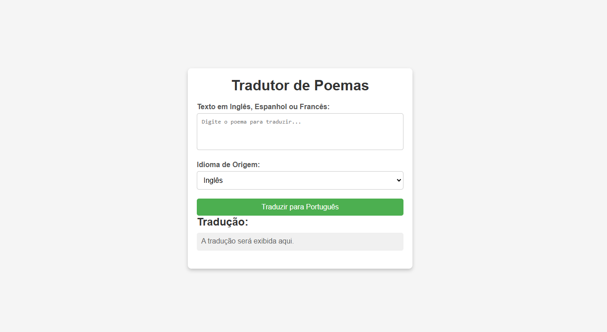

# Projeto de Tradução de Poemas com GCP e Terraform

Este projeto usa Terraform para provisionar uma VM e uma função de tradução de poemas na GCP. A função traduz textos em inglês, espanhol ou francês para o português, utilizando a Google Translate API.

