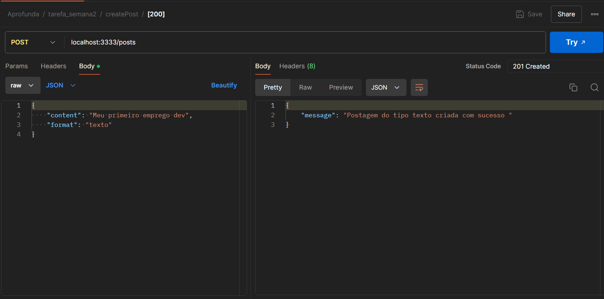
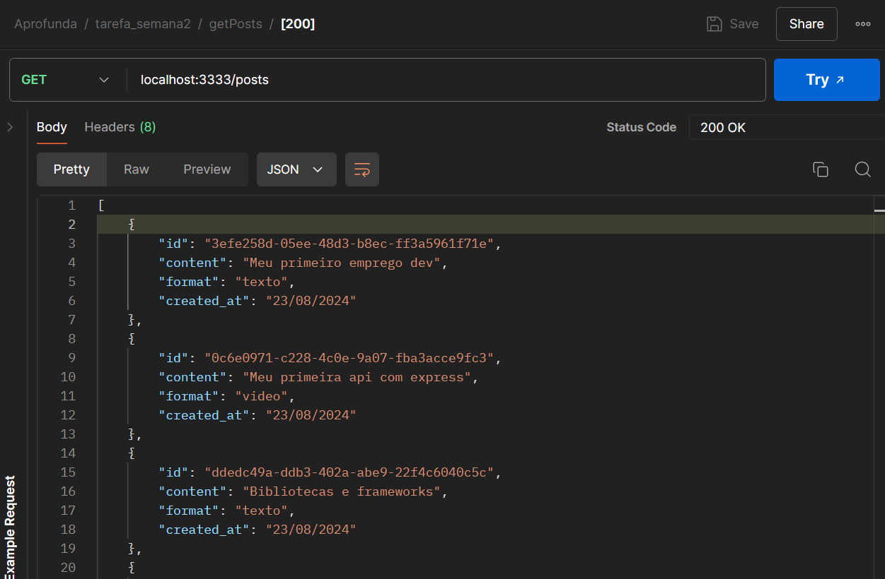
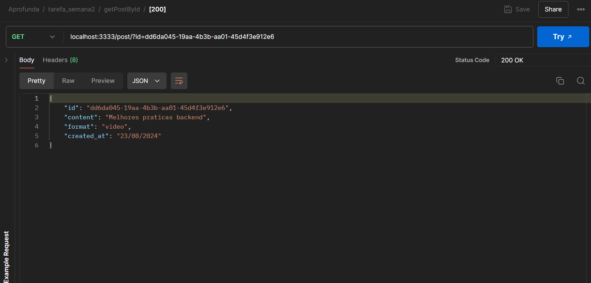
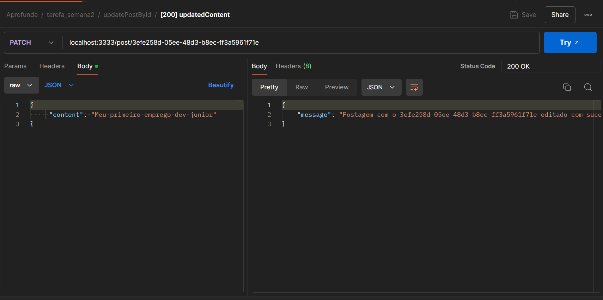
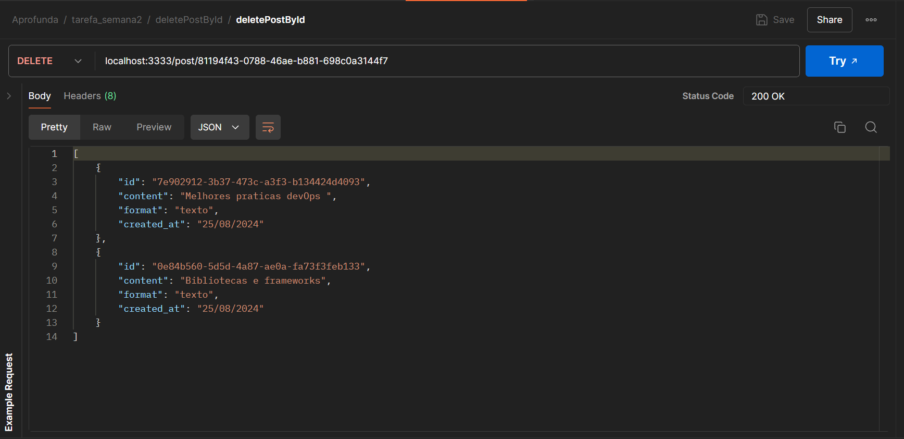

# API de Postagens no LinkedIn 🗒️🖋️

Este projeto é uma API simples construída em Node.js para gerenciar postagens do LinkedIn. A API permite criar, listar, editar e excluir postagens, utilizando a memória da aplicação para armazenamento. 


## Funcionalidades

A API possui as seguintes funcionalidades:

1. **Criar uma postagem**: Permite a criação de uma nova postagem com conteúdo e formato especificados.
2. **Listar todas as postagens**: Retorna uma lista com todas as postagens criadas.
3. **Listar uma postagem específica**: Retorna os detalhes de uma postagem específica com base no ID fornecido.
4. **Editar uma postagem específica**: Permite a edição do conteúdo e/ou formato de uma postagem específica.
5. **Excluir uma postagem específica**: Remove uma postagem da lista com base no ID fornecido.

## Endpoints

### 1. Criar uma Postagem

- **Método:** `POST`
- **Rota:** `/posts`
- **Descrição:** Cria uma nova postagem no LinkedIn com o conteúdo e formato especificados.
- **Corpo da Requisição:**
  - `content` (string): O conteúdo da postagem.
  - `format` (string): O formato da postagem (ex.: texto, imagem, vídeo).
- **Resposta:**
  - **Código:** `201 Created`
  - **Mensagem:**
    ```json
    {
      "message": "Postagem do tipo [formato] criada com sucesso"
    }
    ```

### 2. Obter Todas as Postagens

- **Método:** `GET`
- **Rota:** `/posts`
- **Descrição:** Retorna a lista de todas as postagens criadas na API.
- **Resposta:**
  - **Código:** `200 OK`
  - **Corpo:** Um array de objetos de postagens.
    ```json
    [
      {
        "id": "uuid",
        "content": "Texto da postagem",
        "format": "Texto",
        "created_at": "25/08/2024"
      }
    ]
    ```

### 3. Obter uma Postagem Específica

- **Método:** `GET`
- **Rota:** `/post`
- **Descrição:** Retorna os detalhes de uma postagem específica com base no ID fornecido.
- **Parâmetro de Query:** 
  - `id` (string): O identificador único da postagem.
- **Resposta:**
  - **Código:** `200 OK`
  - **Corpo:** Um objeto com os detalhes da postagem.
    ```json
    {
      "id": "uuid",
      "content": "Texto da postagem",
      "format": "Texto",
      "created_at": "25/08/2024"
    }
    ```
  - **Código:** `404 Not Found`
  - **Mensagem:**
    ```json
    {
      "message": "Postagem com o id [id] não encontrado"
    }
    ```

### 4. Editar uma Postagem Específica

- **Método:** `PATCH`
- **Rota:** `/post/:id`
- **Descrição:** Edita o conteúdo e/ou formato de uma postagem específica.
- **Parâmetro de Rota:** 
  - `id` (string): O identificador único da postagem.
- **Corpo da Requisição:**
  - `content` (string): Novo conteúdo da postagem (opcional).
  - `format` (string): Novo formato da postagem (opcional).
- **Resposta:**
  - **Código:** `200 OK`
  - **Mensagem:**
    ```json
    {
      "message": "Postagem com o id [id] editada com sucesso"
    }
    ```
  - **Código:** `404 Not Found`
  - **Mensagem:**
    ```json
    {
      "message": "Postagem com o id [id] não encontrado"
    }
    ```

### 5. Excluir uma Postagem Específica

- **Método:** `DELETE`
- **Rota:** `/post/:id`
- **Descrição:** Exclui uma postagem específica com base no ID fornecido.
- **Parâmetro de Rota:** 
  - `id` (string): O identificador único da postagem.
- **Resposta:**
  - **Código:** `200 OK`
  - **Corpo:** Um array atualizado de objetos de postagens.
  - **Código:** `404 Not Found`
  - **Mensagem:**
    ```json
    {
      "message": "Postagem com o id [id] não encontrado"
    }
    ```


## Como Rodar o Projeto


Clone o projeto
Instale as depedências com o comando:
- npm install

As principais dependências do projeto são:
 - **express**: Framework para criação de servidores web.
 - **nodemon**: Ferramenta que ajuda no desenvolvimento ao reiniciar automaticamente o servidor quando há mudanças no código.
 - **cors**: Middleware que permite que o servidor defina quais origens podem acessar seus recursos.
- **uuid**: Biblioteca para gerar identificadores únicos universais (UUIDs)

Para rodar o servidor localmente, use o comando: 
- npm start

O servidor estará disponível em http://localhost:3333.

  
## Testes
Você pode usar ferramentas como Postman ou Insomnia para testar os endpoints.
 


### Exemplos de  testes
#### POST



#### GET ALL


#### GET ONE




#### PATCH



#### DELETE




## Aprendizados da semana

- Criação de APIs RESTful com Node.js e Express: Estudei como criar, configurar e gerenciar rotas para uma API.

- Manipulação de Dados na Memória: Explorei como armazenar e gerenciar dados na memória da aplicação, sem uso de banco de dados.

- Testes de API com Insomnia/Postman: Pratiquei o uso de ferramentas para realizar testes em endpoints de APIs, verificando suas respostas e funcionamento.