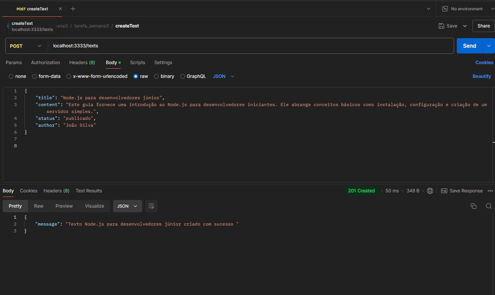
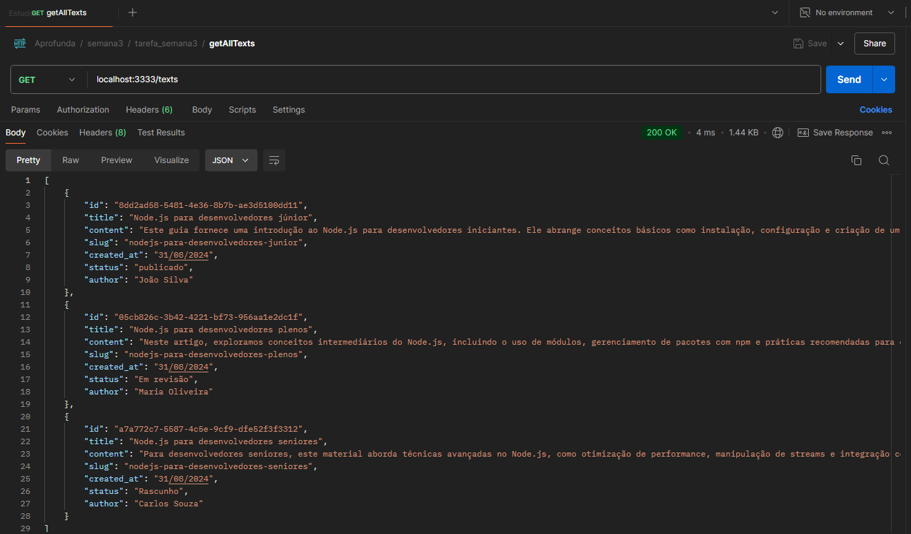
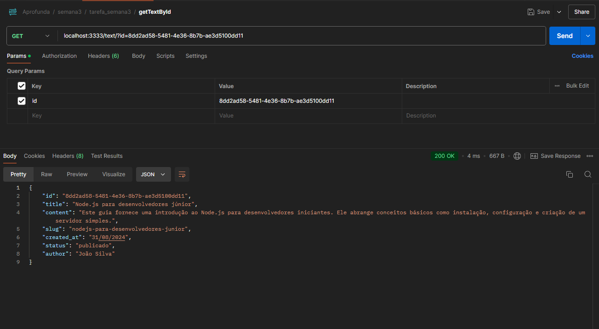
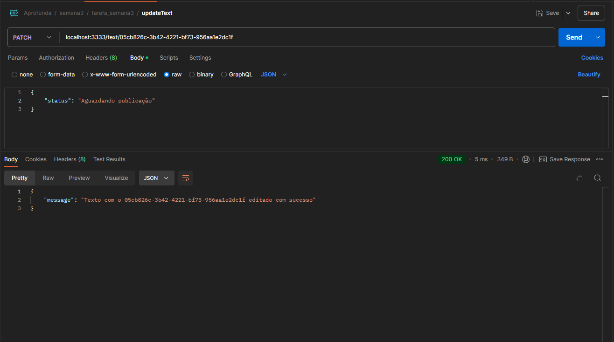
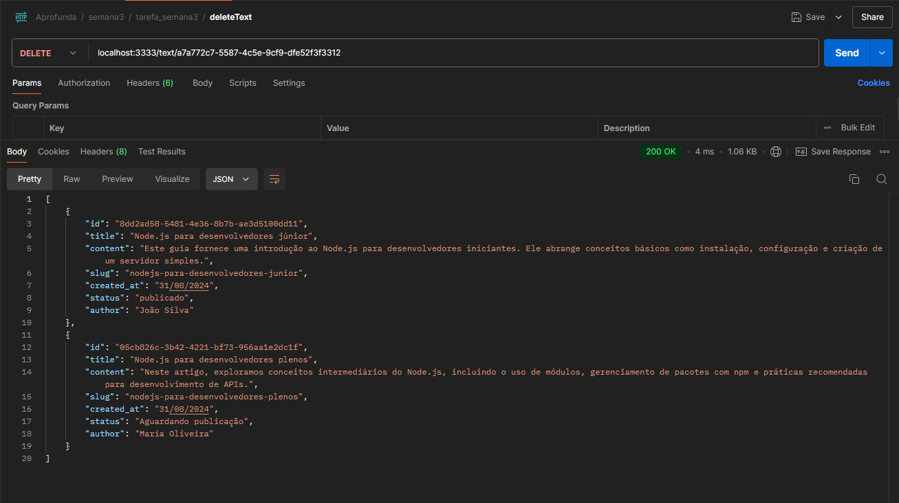

# Projeto Blog Refatorado 🛠️📝 

Este projeto contém a versão refatorada do blog desenvolvido durante a Semana 2 do projeto **Aprofunda**.

## Funcionalidades

A API possui as seguintes funcionalidades:

1. **Criar um texto**: Permite a criação de uma novo texto com conteúdo e formato especificados.
2. **Listar todos os textos**: Retorna uma lista com todos os textos criadas.
3. **Listar um texto específico**: Retorna os detalhes de um texto específico com base no ID fornecido.
4. **Editar um texto específico**: Permite a edição do conteúdo e/ou formato de um texto específico.
5. **Excluir um texto específico**: Remove um texto da lista com base no ID fornecido.

## Endpoints


### 1. Criar um texto

- **Método:** `POST`
- **Rota:** `/texts`
- **Descrição:** Cria um novo texto no blog com o conteúdo e detalhes especificados.
- **Corpo da Requisição:**
  - `title` (string): O título do texto.
  - `content` (string): O conteúdo do texto.
  - `status` (string): O status do texto (ex.: publicado, rascunho).
  - `author` (string): O autor do texto.
- **Resposta:**
  - **Código:** `201 Created`
  - **Mensagem:**
    ```json
    {
      "message": "Texto <Título do Texto> criado com sucesso"
    }
    ```

### 2. Obter Todos os Textos

- **Método:** `GET`
- **Rota:** `/texts`
- **Descrição:** Retorna a lista de todos os textos criados no blog.
- **Resposta:**
  - **Código:** `200 OK`
  - **Corpo:** Um array de objetos de textos.
    ```json
    [
      {
        "id": "uuid",
        "title": "Título do Texto",
        "content": "Conteúdo do Texto",
        "status": "Status",
        "author": "Autor",
        "created_at": "25/08/2024"
      }
    ]
    ```

### 3. Obter um Texto Específico

- **Método:** `GET`
- **Rota:** `/text`
- **Descrição:** Retorna os detalhes de um texto específico com base no ID fornecido.
- **Parâmetro de Query:** 
  - `id` (string): O identificador único do texto.
- **Resposta:**
  - **Código:** `200 OK`
  - **Corpo:** Um objeto com os detalhes do texto.
    ```json
    {
      "id": "uuid",
      "title": "Título do Texto",
      "content": "Conteúdo do Texto",
      "status": "Status",
      "author": "Autor",
      "created_at": "25/08/2024"
    }
    ```
  - **Código:** `404 Not Found`
  - **Mensagem:**
    ```json
    {
      "message": "Texto com ID <ID> não encontrado"
    }
    ```

### 4. Editar um Texto Específico

- **Método:** `PATCH`
- **Rota:** `/text/:id`
- **Descrição:** Edita o conteúdo e/ou detalhes de um texto específico.
- **Parâmetro de Rota:** 
  - `id` (string): O identificador único do texto.
- **Corpo da Requisição:**
  - `title` (string): Novo título do texto (opcional).
  - `content` (string): Novo conteúdo do texto (opcional).
  - `status` (string): Novo status do texto (opcional).
  - `author` (string): Novo autor do texto (opcional).
- **Resposta:**
  - **Código:** `200 OK`
  - **Mensagem:**
    ```json
    {
      "message": "Texto com ID <ID> editado com sucesso"
    }
    ```
  - **Código:** `404 Not Found`
  - **Mensagem:**
    ```json
    {
      "message": "Texto com ID <ID> não encontrado"
    }
    ```

### 5. Excluir um Texto Específico

- **Método:** `DELETE`
- **Rota:** `/text/:id`
- **Descrição:** Exclui um texto específico com base no ID fornecido.
- **Parâmetro de Rota:** 
  - `id` (string): O identificador único do texto.
- **Resposta:**
  - **Código:** `200 OK`
  - **Mensagem:**
    ```json
    {
      "message": "Texto com ID <ID> excluído com sucesso"
    }
    ```
  - **Código:** `404 Not Found`
  - **Mensagem:**
    ```json
    {
      "message": "Texto com ID <ID> não encontrado"
    }
    ```


## Como Rodar o Projeto

Clone o projeto
Instale as depedências com o comando:
- npm install


Para rodar o servidor localmente, use o comando: 
- npm start

O servidor estará disponível em http://localhost:3333.


## Testes
Você pode usar ferramentas como Postman ou Insomnia para testar os endpoints.
 

### Exemplos de  testes
#### POST



#### GET ALL


#### GET ONE




#### PATCH



#### DELETE





## Aprendizados da semana

 - Durante esta semana, o foco foi aprimorar o código original do blog, aplicando boas práticas de desenvolvimento, modularização e organização de arquivos. A refatoração visa melhorar a manutenibilidade, legibilidade e escalabilidade do código.

 - O código que anteriormente estava concentrado em um único arquivo foi reorganizado em módulos separados, seguindo o princípio de responsabilidade única.Uma boa organização de pastas e arquivos melhora a navegabilidade do projeto e ajuda outros desenvolvedores a se orientarem mais rapidamente no código.

 - As funcionalidades foram separadas em pastas específicas, facilitando a localização e o entendimento de cada parte do projeto. A divisão de funcionalidades em arquivos distintos facilita a manutenção e permite uma evolução mais organizada do projeto.


