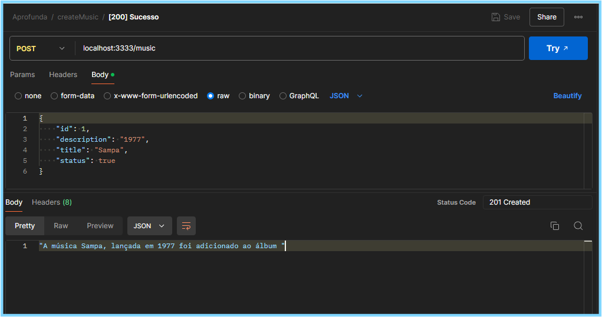
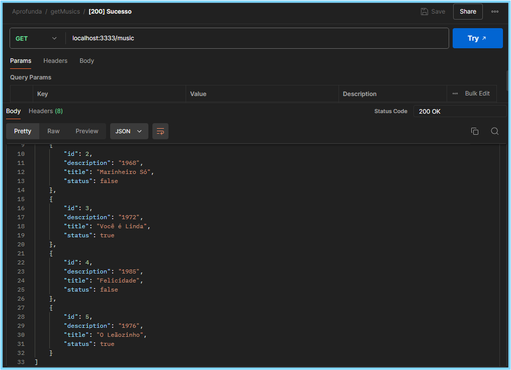

# Discografia Caetano Veloso 💿🎶

Esta API foi desenvolvida como parte da tarefa da primeira semana da formação Aprofunda e permite a manipulação de uma lista de músicas do cantor Caetano Veloso. Ela oferece funcionalidades para adicionar e consultar músicas. Cada música é representada com informações sobre o título, ano de lançamento e se Caetano Veloso é o compositor ou apenas o intérprete.

## Estrutura dos Dados

Cada música é representada por um objeto com os seguintes campos:
- `description`: O ano de lançamento da música.
- `title`: O título da música.
- `status`: Um booleano que indica se Caetano Veloso é o compositor (`true`) ou apenas o intérprete (`false`).

## Endpoints

### 1. Obter Lista de Músicas

- **Método:** `GET`
- **Rota:** `/music`
- **Descrição:** Retorna a lista de todas as músicas armazenadas na API.
- **Resposta:**
  - **Código:** `200 OK`
  - **Corpo:** Um array de objetos de música.

### 2. Adicionar Nova Música

- **Método:** `POST`
- **Rota:** `/music`
- **Descrição:** Adiciona uma nova música à lista.
- **Corpo da Requisição:**
  - `id` (string): Identificador único da música.
  - `description` (string): O ano de lançamento da música.
  - `title` (string): O título da música.
  - `status` (boolean): `true` se Caetano Veloso é o compositor, `false` caso contrário.
- **Resposta:**
  - **Código:** `201 Created`
  - **Mensagem:**  `A música XXXXXXX, lançada em XXXX foi adicionado ao álbum `

## Como Rodar o Projeto

Clone o projeto
Instale as depedências com o comando:
- npm install

As principais dependências do projeto são:
 - express: Framework para criação de servidores web.
 - nodemon: Ferramenta que ajuda no desenvolvimento ao reiniciar automaticamente o servidor quando há mudanças no código.

Para rodar o servidor localmente, use o comando: 
- npm start

O servidor estará disponível em http://localhost:3333.

  
## Testes
Você pode usar ferramentas como Postman ou Insomnia para testar os endpoints.
 

### Exemplos de  testes
#### POST

#### GET

