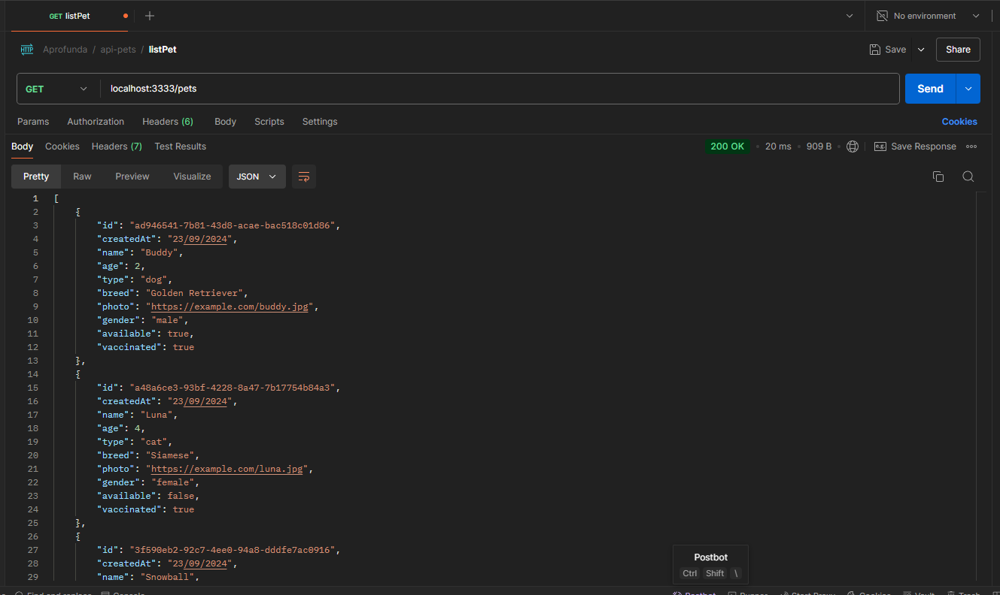
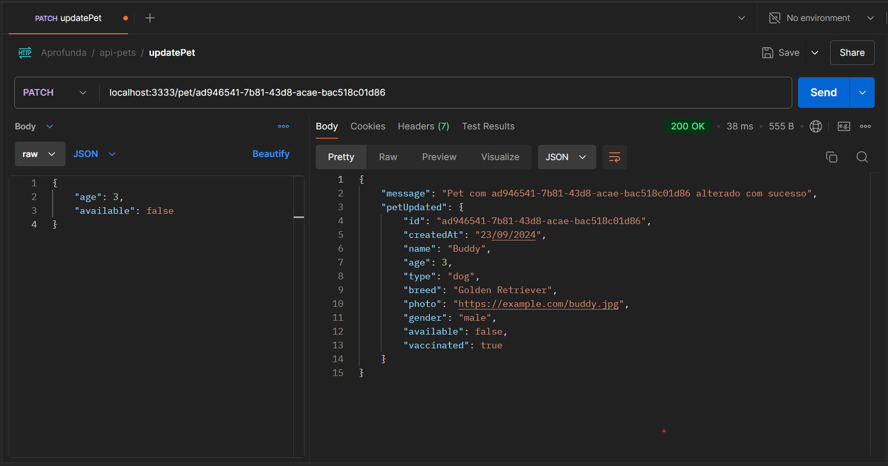
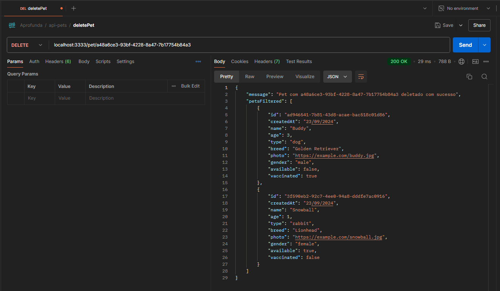

# Sistema de adoção de pets 🐶🐾🐈 

Esse projeto é uma API de Sistema de Adoção de Pets, desenvolvida para facilitar o gerenciamento e acompanhamento dos animais disponíveis para adoção. Ela oferece um conjunto de funcionalidades essenciais para o controle dos pets cadastrados no sistema. Desenvolvida com Clean Architecture e TypeScript, essa API garante um design modular, sustentável e escalável, facilitando a manutenção e expansão do sistema ao longo do tempo, além de promover boas práticas de desenvolvimento de software.

## Funcionalidades

A API possui as seguintes funcionalidades:

1. **Criar um pet**: Permite a criação de uma novo pet com conteúdo e formato especificados.
2. **Listar todos os pets**: Retorna uma lista com todos os pets criadas.
3. **Editar um pet específico**: Permite a edição das informações de um pet específico.
4. **Excluir um pet específico**: Remove um pet da lista com base no ID fornecido.


## Endpoints


### 1. Criar um pet

- **Método:** `POST`
- **Rota:** `/pets`
- **Descrição:** Cria um novo pet no sistema com o conteúdo e detalhes especificados.
- **Corpo da Requisição:**
  - `name` (string): Nome do pet.
  - `age` (number): Idade do pet.
  - `type` (string): Tipo de pet(ex.: cachorro, gato).
  - `breed` (string): Raça do pet.
  - `photo` (string): URL da imagem do pet.
  - `gender` (string): Genero do pet (macho ou femea).
  - `available` (boolean): Pet disponivel para adoção.
  - `vaccinated` (boolean): Pet vacinado. 
  
- **Resposta:**
  - **Código:** `201 Created`
  - **Mensagem:**
    ```json
    {
      "message": "Pet <Nome do Pet> criado com sucesso"
    }
    ```

### 2. Obter todos os Pets

- **Método:** `GET`
- **Rota:** `/pets`
- **Descrição:** Retorna a lista de todos os pets criados.
- **Resposta:**
  - **Código:** `200 OK`
  - **Corpo:** Um array de objetos de pets.
    ```json
    [
       {
        "id": "4f8c27f7-efe1-46b4-ab36-db055579233b",
        "createdAt": "22/09/2024",
        "name": "Nome",
        "age": 9,
        "type": "dog",
        "breed": "Golden Retriever",
        "photo": "https://example.com/buddy.jpg",
        "gender": "male",
        "available": true,
        "vaccinated": false
    }
    ]
    ```


### 3. Editar um Pet Específico

- **Método:** `PATCH`
- **Rota:** `/pet/:id`
- **Descrição:** Edita o conteúdo e/ou detalhes de um pet específico.
- **Parâmetro de Rota:** 
  - `id` (string): O identificador único do pet.
- **Corpo da Requisição:**
  
 - `name` (string): Novo Nome do pet (opcional).
 - `photo` (string): Nova URL da imagem do pet (opcional).
  - `available` (boolean): Atualização da disponibilidade do pet (opcional).
  - `vaccinated` (boolean): atualização da vacinação do Pet vacinado (opcional). 
- **Resposta:**
  - **Código:** `200 OK`
  - **Mensagem:**
    ```json
    {
      "message": "Pet com ID <ID> editado com sucesso"
    }
    ```
  - **Código:** `404 Not Found`
  - **Mensagem:**
    ```json
    {
      "message": "Pet com ID <ID> não encontrado"
    }
    ```

### 4. Excluir um Pet Específico

- **Método:** `DELETE`
- **Rota:** `/pet/:id`
- **Descrição:** Exclui um pet específico com base no ID fornecido.
- **Parâmetro de Rota:** 
  - `id` (string): O identificador único do pet.
- **Resposta:**
  - **Código:** `200 OK`
  - **Mensagem:**
    ```json
    {
      "message": "Pet com ID <ID> excluído com sucesso"
    }
    ```
  - **Código:** `404 Not Found`
  - **Mensagem:**
    ```json
    {
      "message": "Pet com ID <ID> não encontrado"
    }
    ```


## Como Rodar o Projeto

Clone o projeto
Instale as depedências com o comando:
- npm install


Para rodar o servidor localmente, use o comando: 
- npm start

O servidor estará disponível em http://localhost:3333.


## Testes
Você pode usar ferramentas como Postman ou Insomnia para testar os endpoints.
 

### Exemplos de  testes
#### POST


#### GET ALL



#### PATCH



#### DELETE




## Aprendizados da semana

 - Esta semana os aprendizados foram focados em Clean Architecture, TypeScript, Domain-Driven Design (DDD), Programação Orientada a Objetos (POO) e os princípios SOLID, que juntos oferecem uma base sólida para o desenvolvimento de software de alta qualidade.

 - No estudo de Clean Architecture, aprendi a importância de separar responsabilidades em camadas distintas, onde a regra de negócio permanece independente de detalhes como frameworks, banco de dados e interfaces. Isso permite que o código seja mais modular, escalável e de fácil manutenção. 

 - Domain-Driven Design (DDD) reforçou a necessidade de alinhar o design do software ao negócio. A criação de Entidades, Value Objects e Aggregates com base nos conceitos do domínio é essencial para garantir que o código represente com precisão a lógica e as regras de negócio. 

- Na parte de Programação Orientada a Objetos (POO), revisitei conceitos como encapsulamento, herança, abstração e polimorfismo. Esses pilares, aliados ao DDD e à Clean Architecture, mostram como organizar o código de forma clara e representativa dos processos do mundo real, garantindo uma solução escalável e de fácil entendimento.

- Os princípios SOLID tratam de boas práticas de design de software. Entender cada um dos princípios – Single Responsibility Principle (Princípio da Responsabilidade Única), Open/Closed Principle (Princípio do Aberto/Fechado), Liskov Substitution Principle (Princípio da Substituição de Liskov), Interface Segregation Principle (Princípio da Segregação de Interface) e Dependency Inversion Principle (Princípio da Inversão de Dependência) – foi essencial para garantir que o código seja fácil de modificar, testar e escalar. 

